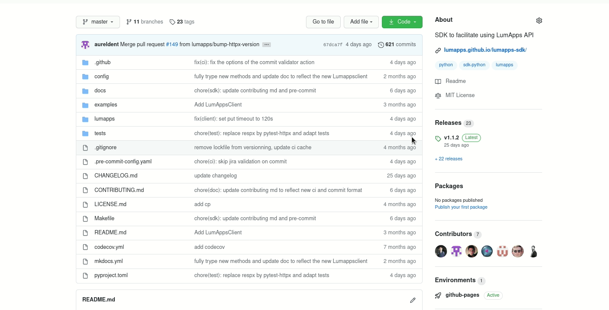

# Contributing

Contributions are welcome, and they are greatly appreciated! Every little bit helps, and credit will always be given.

## __Environment setup__

First install dependencies and setup pre-commits hooks

```bash
make setup
```

To setup using a different version of python, you may use the following:

```bash
PYTHON=python3.X make setup
```

Then to go in the poetry virtual env do

```
source .venv/bin/activate
```

You can run `make help` to see all available actions !

### Adding a new dependency

To add a dependency use poetry

```bash
poetry add <dependency>
```

## __Dev__

### __Code__

First open an issue to discuss the matter before coding.
When your idea has been approved, create a new branch `git checkout -b <new_branch_name>` and open a Pull Request.

Before commiting you can run tests and type checks via the commands

```bash
make check
make test
```

### __Commits format__

Commits format is enforced according to the tool https://github.com/lumapps/commit-message-validator

Each commit message consists of a header, a body and a footer. The header has a special format that includes a type, a scope and a subject:

```
<type>(<scope>): <subject>
<BLANK LINE>
<body>
<BLANK LINE>
<footer>
```

* The first line of the commit message (the "Subject") cannot be longer than 70 characters.
* Any other line of the commit message cannot be longer 100 characters!
* The body and footer are optional, but depends on the type, information can be mandatory.

This allows the message to be easier to read on github as well as in various git tools.

Example:
```
feat(toto-service): provide toto for all

Before we had to do another thing. There was this and this problem.
Now, by using "toto", it's simpler and the problems are managed.
```

**Type**

Must be one of the following:

* feat: A new feature
* fix: A bug fix
* docs: Documentation only changes
* lint: Changes that do not affect the meaning of the code (white-space, formatting, missing semicolons, etc)
* refactor: A code change that neither fixes a bug or adds a feature
* test: Adding missing tests or correcting existing tests
* chore: Changes to the build process or auxiliary tools and libraries such as distribution generation


> More: For more informations about the commit format see [here](https://github.com/lumapps/commit-message-validator#commit-message-format)

>Note: A pre-commit hook as well as an action will check that for you and PR need to respect that format to be merged.

## __Documentation__

Additionnaly to edit the documentation you can add/modify markdown files in the docs folder.
You can preview the doc by running 

```bash
make docs-serve
```

Then to deploy the doc you can run

```bash
make docs-deploy
```


## __Deploy a new version (admins)__


### __Regular release__

Simply create and push the tag X.Y.Z on master. 

```
git tag X.Y.Z
git push origin master X.Y.Z
```

This will create a draft release, you'll then need to publish it.



Finally the CI will release the corresponding package version on Pypi, bump the version and publish the doc for you.

### __Beta release__

Doing a beta release is a bit different, we do not use tag automation for the time being.

Simply publish a pre-release on github with the correct tag (eg, 1.1.3b1) and this will trigger the publication on Pypi