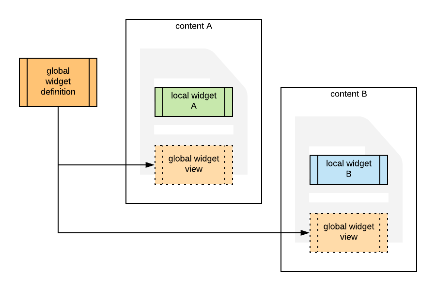

# Widgets

## Regular widgets

Regular widgets are present in contents, communities and alike. They are in the template > components attribute and can be tricky to get to.

To help you with that the sdk expose a set of helpers to easly recuperate and modify widgets.
You can find them in `lumapps.api.helpers.widgets`.

The two interresting helpers are `find_widget` and `find_all_widgets`.

For instance, if you want all widgets of type video present in content you can process as follow:

```python
from lumapps.api.client import BaseClient
from lumapps.api.helpers.widgets import find_all_widgets

client = BaseClient(token="<your_token>")

# Get the content containing the widgets
content = client.get_call("content/get", uid="fake_id")

# Find all widgets having the property widgetType="video"
video_widgets = find_all_widgets(content, widgetType="video")
```

You can also use that to modify some widgets. For instance let say we want to modify a widget that we know has an `uuid` of *454673774*, we would do as follow

```python
from lumapps.api.client import BaseClient
from lumapps.api.helpers.widgets import find_all_widgets

client = BaseClient(token="<your_token>")

# Get the content containing the widgets
content = client.get_call("content/get", uid="fake_id")

# Find the widget that has the uuid 454673774
widget = find_widget(content, uuid="454673774")

widget["popertie"] = "new value"

client.get_call("content/save", body=content)
```

## Global widgets
Global Widgets have one configuration that can be shared with many contents.



<!-- https://www.lucidchart.com/documents/edit/265399ed-15f4-423d-ae0b-3ee846e1a092/0_0?beaconFlowId=15FDFE2708C85DCB -->

Global widgets have a dedicated api : ̀`widget`. with this api you can list, get and update global widgets.

### Global widget list

Api `widget/list`, provide `instance` id

```python

response = api.get_call("widget/list", instance=INSTANCE_ID)

# example
[
    {
        "id": "6448894901878784",
        "uid": "6448894901878784",
        "instance": "5519565001981952",
        "customer": "4664706704080896",
        "widgetType": "html",
        "uuid": "7ea7407f-149e-489f-b00f-86f49512f555",
        "title": {
            "en": "Global Widget"
        },
        "properties": {
            "style": {
                "footer": {},
                "header": {}
            },
            "content": {
                "en": "<p>global html widget content</p>"
            },
            "popin": {
                "en": ""
            },
            "stylesMigrated": true,
            "global": {
                "isNew": true,
                "title": {
                    "en": "Global html widget"
                }
            }
        },
        "isMainWidget": false,
        "enabled": false,
        "isOverride": false,
        "isGlobal": true,
        "required": false,
        "status": "LIVE"
    }
]
```

### Global widget get

Api `widget/get`, provide `widget` uid


```python
response = api.get_call('widget/get', uid="6448894901878784")

# example

{
    "id": "6448894901878784",
    "uid": "6448894901878784",
    "instance": "5519565001981952",
    "customer": "4664706704080896",
    "widgetType": "html",
    "uuid": "7ea7407f-149e-489f-b00f-86f49512f555",
    "title": {
        "en": "Global Widget"
    },
    "properties": {
        "style": {
            "footer": {},
            "header": {}
        },
        "content": {
            "en": "<p>global html widget content</p>"
        },
        "popin": {
            "en": ""
        },
        "stylesMigrated": true,
        "global": {
            "isNew": true,
            "title": {
                "en": "Global html widget"
            }
        }
    },
    "isMainWidget": false,
    "enabled": false,
    "isOverride": false,
    "isGlobal": true,
    "required": false,
    "status": "LIVE"
}
```


### global widget save

Api `widget/save`, provide the widget object in the body

```python
# First get the object
widget = api.get_call('widget/get', uid="6448894901878784")

# update some properties
widget['properties']['content']['en'] = "<p>updated content</p>"

# save
saved_widget = api.get_call('widget/save', body=widget)
```
